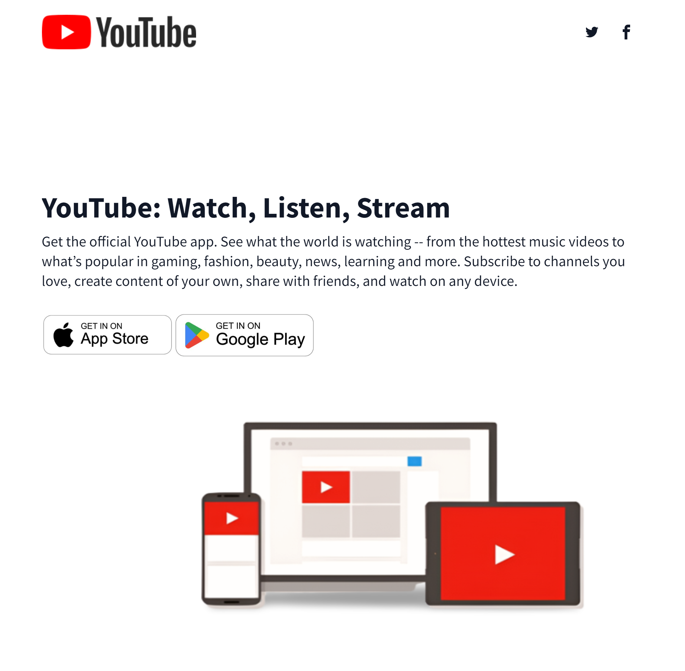

## YouTube Landing Page Template

This project is a basic HTML template for a landing page that resembles the YouTube website. It uses Tailwind CSS for styling and includes animations for a more engaging look.

**Features**

* Clean and simple layout replicating YouTube's branding
* Hero section with title, subtitle, and download buttons for mobile apps
* Social media icons linking to YouTube's social media profiles
* Placeholder image showcasing devices using YouTube

**Installation**

This project uses external resources like Tailwind. It uses CDN link i.e. `` for connecting script of **TAILWIND CSS.**

**Note**

* This code snippet is a starting point and may require further development to be a fully functional website.
* Replace placeholder images (`img/logo.png`, `img/appstore.jpg`, `img/googleplay.jpg`, `img/ytdevices.png`) with your own designs.

## Looks  

